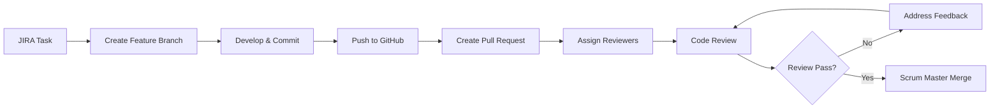

# Contributing to W10A_DONUT - Automated Reporting Tool

## Project Overview
This project is an **Automated Reporting and Insight Generation Tool** for UNSW, built as part of COMP3900/9900. The system consists of a three-layer architecture:
- **Frontend**: React + Vite desktop GUI
- **Backend**: Flask Python service layer
- **Desktop**: Electron wrapper for cross-platform deployment

## 🏗️ Project Structure
```
automated-reporting-tool/
├── frontend/          # React + Vite GUI components
├── backend/           # Flask API services
├── electron/          # Electron main process
├── docs/             # Documentation
├── tests/            # Test suites
└── .github/          # CI/CD workflows
```

## 🌿 Branch Management

### Branch Naming Convention
All development must be done on feature branches. **Never push directly to `main`!**

**Format**: `W10ADONUT-<ticket-number>-<feature-description>`

**Examples**:
```
W10ADONUT-45-add-upload-api
W10ADONUT-46-create-dashboard-ui
W10ADONUT-47-implement-pdf-generation
```

### Creating a Feature Branch
```bash
git checkout main
git pull origin main
git checkout -b W10ADONUT-45-add-upload-api
```

## 📝 Commit Message Guidelines

### Format
```
W10ADONUT-<ticket-number>: <concise description>
```

### Examples
```
W10ADONUT-45: Implement file upload API and validation
W10ADONUT-46: Add data cleaning service with pandas
W10ADONUT-47: Create PDF report generation module
```

### Best Practices
- Keep commits atomic (one logical change per commit)
- Ensure code compiles and runs before committing
- Write descriptive commit messages that explain the "what" and "why"

## 🔄 Pull Request (PR) Workflow

### 1. Creating a Pull Request

**PR Title Format**: `W10ADONUT-<ticket-number>: <feature summary>`

**PR Description Template**:
```markdown
## Summary
Brief description of what this PR accomplishes.

## Changes Made
- List key changes
- Mention affected modules
- Note any breaking changes

## Testing
- [ ] Code compiles successfully
- [ ] Manual testing completed
- [ ] No regression in existing features

## Related Ticket
Closes W10ADONUT-<ticket-number>
```

### 2. Assigning Reviewers
- **Mandatory**: Assign 1-2 team members as reviewers
- **Scrum Master** (Binglin Yan) has final merge authority
- **Product Owner** (Sathya) may be assigned for UI/UX related changes

### 3. Reviewer Selection
- **Mandatory**: Assign 1-2 team members as reviewers based on expertise and availability
- **Scrum Master** (Binglin Yan) has final merge authority
- **Product Owner** (Sathya) may be assigned for UI/UX related changes

## 👥 Code Review Standards

### Reviewer Responsibilities
- **Approve**: Code meets standards and is ready to merge
- **Request Changes**: Issues found that must be addressed
- **Comment**: Suggestions for improvement (non-blocking)

### Review Checklist
- [ ] Code follows project conventions
- [ ] Logic is correct and efficient
- [ ] No hardcoded values or security issues
- [ ] Documentation updated if needed
- [ ] No breaking changes to existing APIs
- [ ] File structure is appropriate

### Review Timeline
- Reviewers should complete reviews within **24 hours** of assignment
- If urgent, mention reviewers in PR comments or Slack

## 🚀 Merge Process

### Requirements Before Merge
1. ✅ At least **1 approval** from assigned reviewers
2. ✅ All CI/CD checks pass (when implemented)
3. ✅ No merge conflicts
4. ✅ Scrum Master final approval

### Merge Execution
- **Only Scrum Master** (Binglin Yan) performs the final merge
- Use **"Squash and merge"** to keep main branch history clean
- Delete feature branch after successful merge

## 🛠️ Development Workflow



## 📋 Sprint-Specific Guidelines

### Sprint 1 (June 21 - July 5, 2025)
**Focus**: Core functionality - file upload, data cleaning, PDF generation, email delivery

**Key Modules**:
- File Upload & Validation (EPIC-01)
- Data Cleaning & Processing (EPIC-02)
- Report Generation (EPIC-03)
- Desktop GUI (EPIC-05)
- Email Delivery (EPIC-07)

### Sprint 2 (July 6 - July 23, 2025)
**Focus**: Enhanced features - anomaly detection, configuration interface

### Sprint 3 (July 24 - August 6, 2025)
**Focus**: Polish, testing, NLP integration

## 🚫 What NOT to Do

- ❌ **Never push directly to `main` branch**
- ❌ **Never merge your own PR without review**
- ❌ **Don't commit broken code**
- ❌ **Don't include sensitive data (API keys, passwords)**
- ❌ **Don't commit large binary files**

## 🔐 Branch Protection Rules

The `main` branch is protected with the following rules:
- Require pull request reviews before merging
- Require status checks to pass before merging
- Restrict pushes that create merge conflicts
- Only designated maintainers can merge

## 📞 Communication Channels

- **General Updates**: Team Slack channel
- **Code Issues**: GitHub PR comments
- **Sprint Planning**: Weekly stand-ups
- **Urgent Issues**: Direct message Scrum Master

## 🆘 Getting Help

If you encounter issues with this workflow:
1. Check this documentation first
2. Ask in team Slack channel
3. Contact Scrum Master (Binglin Yan - z5506683@ad.unsw.edu.au)
4. Reach out to Product Owner (Sathya - z5500376@ad.unsw.edu.au)

## 📚 Useful Git Commands

### Daily Workflow
```bash
# Start new feature
git checkout main && git pull
git checkout -b W10ADONUT-XX-feature-name

# Regular commits
git add .
git commit -m "W10ADONUT-XX: Implement feature functionality"

# Push feature branch
git push origin W10ADONUT-XX-feature-name

# Update feature branch with latest main
git checkout main && git pull
git checkout W10ADONUT-XX-feature-name
git merge main
```

### Emergency Commands
```bash
# Undo last commit (if not pushed)
git reset --soft HEAD~1

# Discard local changes
git checkout -- .

# Force sync with remote
git fetch origin
git reset --hard origin/main
```

---

**Remember**: Following these guidelines ensures smooth collaboration and maintains code quality throughout our project development. When in doubt, ask the team! 🚀

**Last Updated**: June 25, 2025
**Maintained by**: W10A_DONUT Team